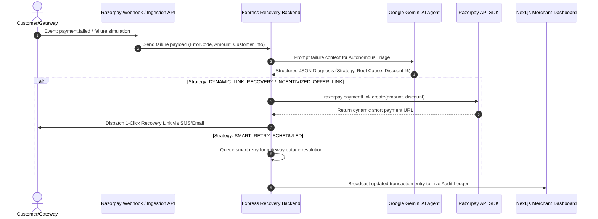

# Razorpay Autonomous Revenue Recovery Engine 🚀
> **Razorpay Buildathon 2026** — *Track 03: AI Revenue Recovery*

An autonomous AI revenue recovery system built for Razorpay merchants to eliminate lost GMV caused by cart drops, OTP timeouts, session expirations, and bank/gateway outages.

## 🎥 Demo Video

(https://youtu.be/oHFt_JnVpsM)

> 💡 *Click the preview image above to watch the full demo on YouTube.*
---

## 📌 Track & Problem Statement

* **Hackathon Track:** Track 03: AI Revenue Recovery (Razorpay Buildathon 2026)
* **Problem Statement:** E-commerce merchants lose millions in Gross Merchandise Value (GMV) daily due to friction in checkout flows. Key loss drivers include:
  1. **OTP & Auth Timeouts:** Customers abandoning checkouts during bank 2FA/OTP handshakes.
  2. **Cart Drop-Offs & Hesitation:** High-value carts left abandoned mid-checkout.
  3. **Bank & Gateway Outages:** Temporary issuing bank downtime leading to hard payment failure codes (`GATEWAY_ERROR`, `BAD_REQUEST_PAYMENT_TIMED_OUT`).

---

## 🏗️ Architecture & Workflow

The system operates an end-to-end autonomous triage loop: **Event Ingestion ➔ Gemini Agent Triage ➔ Bounded Razorpay Action ➔ Live Merchant Dashboard Audit**.



### Detailed Workflow Steps:
1. **Event Ingestion:** Live webhook listener (`/api/webhook`) ingests `payment.failed` events, or merchants simulate failures (`/api/simulate-failure`).
2. **Gemini Agent Triage:** The `runRecoveryAgent` leverages Google Gemini AI (`gemini-1.5-flash`) with structured JSON outputs to diagnose the failure root cause and choose one of 3 recovery strategies:
   - `DYNAMIC_LINK_RECOVERY`: For authentication drops or OTP timeouts.
   - `INCENTIVIZED_OFFER_LINK`: Applies dynamic discounts (5-10%) for cart hesitation.
   - `SMART_RETRY_SCHEDULED`: Queues automated retries for bank infrastructure outages.
3. **Bounded Razorpay Action:** Interacts securely with the Razorpay Node SDK to issue dynamic 1-click payment links (`short_url`).
4. **Merchant Audit Dashboard:** Displays real-time metrics (Revenue at Risk, Recovered Revenue, Recovery Rate) and an audit ledger of all agent decisions.

---

## 🛠️ Tech Stack

* **Backend Engine:** Node.js, Express.js, Cors, Dotenv
* **AI & Agentic Logic:** Google Gemini API (`@google/genai` SDK, `gemini-1.5-flash`)
* **Payments Infrastructure:** Razorpay Node SDK (`razorpay`)
* **Merchant Dashboard:** Next.js 16 (App Router), React 19, Tailwind CSS, Lucide React icons

---

## 🚀 Quickstart & Setup Instructions

### Prerequisites
* **Node.js**: v18.x or higher
* **npm**: v9.x or higher
* **Razorpay Test Account**: Key ID & Secret from [Razorpay Dashboard](https://dashboard.razorpay.com/)
* **Google Gemini API Key**: API key from [Google AI Studio](https://aistudio.google.com/)

---

### 1. Environment Configuration

Create a `.env` file in the `backend/` directory (`backend/.env`):

```env
PORT=5000
RAZORPAY_KEY_ID=your_razorpay_key_id
RAZORPAY_KEY_SECRET=your_razorpay_key_secret
GEMINI_API_KEY=your_gemini_api_key
```

*(Note: `.env` is listed in `.gitignore` and must never be committed to version control.)*

---

### 2. Run Backend Recovery Engine

```bash
# Navigate to backend directory
cd backend

# Install dependencies
npm install

# Start backend server
node index.js
```
The backend server will start on `http://localhost:5000`.

---

### 3. Run Frontend Merchant Dashboard

Open a new terminal window:

```bash
# Navigate to frontend directory
cd frontend

# Install dependencies
npm install

# Start Next.js development server
npm run dev
```
The merchant dashboard will run at `http://localhost:3000`.

---

### 4. Verify & Test Recovery Workflow

1. Open `http://localhost:3000` in your web browser.
2. Click **"Simulate Timeout (₹2,499)"** or **"Simulate Gateway Failure (₹4,999)"** to trigger the AI recovery triage loop.
3. Observe live updates in **Revenue at Risk**, **Recovered Revenue**, and the **Live Agent Audit Ledger**.
4. You can also trigger webhooks via PowerShell or `curl`:

```powershell
$webhookPayload = @{
  event = "payment.failed"
  payload = @{
    payment = @{
      entity = @{
        id = "pay_test_12345"
        amount = 349900
        currency = "INR"
        status = "failed"
        error_code = "BAD_REQUEST_PAYMENT_TIMED_OUT"
        error_description = "Customer exited OTP auth modal"
        email = "vikram.patel@example.com"
        contact = "+919876543210"
        notes = @{ customer_name = "Vikram Patel" }
      }
    }
  }
} | ConvertTo-Json -Depth 6

Invoke-RestMethod -Uri "http://localhost:5000/api/webhook" -Method POST -ContentType "application/json" -Body $webhookPayload
```

---

## 🔒 Security & Safety Controls
* **Bounded Tool Use:** The AI Agent only returns structured JSON decisions; financial execution (link generation, pricing rules) is strictly bounded by backend code validation.
* **Secret Protection:** All environment credentials (`GEMINI_API_KEY`, `RAZORPAY_KEY_SECRET`) are kept isolated on the server.
